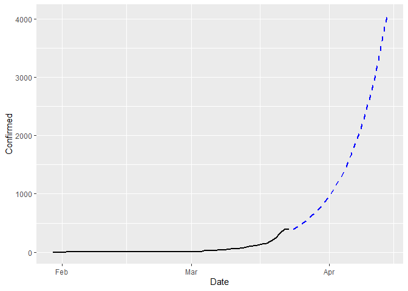

# The Current Global Scenario

At the end of December 2019, a cluster of an unknown pneumonia like cases were reported in Wuhan, a city in the Hubei province, China. They quickly identified that the source of the infection was a novel coronavirus belonging to the coronavirus family, which includes the virus related to the outbreaks of  Severe Acute Respiratory Syndrome (SARS) from 2002-2004 and Middle East Respiratory Syndrome (MERS) in 2012. It  spread through and outside of Wuhan, resulting in an rapidly escalating and deadly contagious epidemic throughout China, followed by an increasing number of cases in other countries throughout the world.  
On January 30, the WHO declared coronavirus a global emergency  as the death toll in China jumped to 170, with 7,711 cases reported in the country, where the virus had spread to all 31 provinces.  In mid-February WHO announced that the new coronavirus would be called "COVID-19".

China's bold approach to contain the rapid spread of this new respiratory pathogen  by massive lockdowns and electronic surveillance measures has changed the changed the course of the epidemic . The number of new infections reported in China has been declining gradually. With over 422,915 reported cases and more than 18,543 recorded deaths worldwide , the outbreak of COVID-19 has surpassed the toll of the 2002-2003 SARS outbreak, which also originated in China and is expected to continue to increase.  Although the infection originated in China, now the epicenter of the pandemic is Europe, which now has more cases reported each day than China did at the height of its outbreak.  In Italy alone the COVID-19 has infected more than 69,000 people and killed at least 6,800. There is an increasing number of cases in several EU/EEA countries without epidemiological links to explain the source of transmission. The speed with which COVID-19 can cause nationally incapacitating epidemics once transmission within the community is established indicates that it is likely that in a few weeks or even days, similar situations to those seen in China and Italy may be seen in other EU/EEA countries or the UK, as more countries report evidence of community transmission.
The COVID-19 virus spreads primarily through droplets of saliva or discharge from the nose when an infected person coughs or sneezes.  At the time of this writing, there are no specific vaccines or treatments for COVID-19 which is generally accepted.  


# Introduction

This is a post to give a basic understanding of statistical modelling of epidemiology. In past few days of Shelter-in-place lockdown situation in Kolkata (and throughout the whole India from today onwards), me and one of my friend [Subhrajyoty Roy](https://subroy13.github.io/) (we were attending the same college before lockdown to purse Masters degree in Statistics), was reading about different epidemiological models available in the literature and using it to generate projections for the number of infected people in India.

In this post, we shall explore the performance of deterministic SIR model which to be fitted using a least squares procedure. Then, we shall use it to generate projections for the epidemic situation in India, till the end of this lockdown, which is currently annouced to be remain till April 14, 2020, about 3 weeks from today.


# Exploratory Analysis

Before proceeding with introducing the SIR model, let us first read the data into `R` (which is what we are going to use through out), and perform some exploratory analysis. We shall be using the [tidyverse](https://www.tidyverse.org/) library, which is a collection of some very useful packages for data proprocessing and exploratory analysis.


```r
library(readr)
library(dplyr)
library(tidyr)
library(lubridate)
library(ggplot2)
```

For the related coronavirus, there are may different sources available. Many international organizations like WHO (World Health Organization), ECDC (European Centre for Disease Prevention and Control) and many national governments are releasing day to day basis publicly available data. As well as different news agencies are also collecting and compileing data from the hospitals and different other sources on a regular basis. John Hopkins University (JHU) CSSE department has also released a dataset compiled from the collection of these sources in a github repository [here](https://github.com/CSSEGISandData/COVID-19).

The datasets are being updated on a daily basis. We shall use this data provided by [JHU CSSE](https://github.com/CSSEGISandData/COVID-19).


```r
confirmed.dat <- read_csv('./datasets/time_series_19-covid-Confirmed.csv')
deaths.dat <- read_csv('./datasets/time_series_19-covid-Deaths.csv')
recovered.dat <- read_csv('./datasets/time_series_19-covid-Recovered.csv')

confirmed.dat <- confirmed.dat %>%
    rename( State = `Province/State`, Country = `Country/Region` ) %>% 
    gather(key = "Date", value = "Confirmed", -c(1:4) ) %>%
    mutate(Date = mdy(Date))
    

deaths.dat <- deaths.dat %>%
    rename( State = `Province/State`, Country = `Country/Region` ) %>% 
    gather(key = "Date", value = "Deaths", -c(1:4) ) %>% 
    mutate(Date = mdy(Date))

recovered.dat <- recovered.dat %>%
    rename( State = `Province/State`, Country = `Country/Region` ) %>% 
    gather(key = "Date", value = "Recovered", -c(1:4) ) %>%
    mutate(Date = mdy(Date))


# merge all of them together
dat <- Reduce(merge, list(confirmed.dat, deaths.dat, recovered.dat))
dat <- as_tibble(dat)

knitr::kable(head(dat, 5))
```


| State     |  Country  |   Lat    |   Long    | Date       |  Confirmed |  Deaths |  Recovered |
|-----------|-----------|----------|-----------|------------|------------|---------|------------|
| Adams, IN |  US       |  39.8522 |  -77.2865 | 2020-01-22 |       0    |    0    |    0       |
| Adams, IN |  US       |  39.8522 |  -77.2865 | 2020-01-23 |       0    |    0    |    0       |
| Adams, IN |  US       |  39.8522 |  -77.2865 | 2020-01-24 |       0    |    0    |    0       |
| Adams, IN |  US       |  39.8522 |  -77.2865 | 2020-01-25 |       0    |    0    |    0       |
| Adams, IN |  US       |  39.8522 |  -77.2865 | 2020-01-26 |       0    |    0    |    0       |


Now we shall try to see how the total number of Confirmed, deaths and recovered people changed across the globe.


```r
temp <- dat %>% group_by(Date) %>% 
    summarise(Confirmed = sum(Confirmed), Deaths = sum(Deaths), Recovered = sum(Recovered)) %>%
    gather(key = "Variable", value = "Count", -Date)

ggplot(temp, aes(x = Date, y = Count, color = Variable)) + geom_line(size = 1)
```


The situation is very severe, as the current trend in exponentially increasing in terms of confirmed cases, and the growth rate of recovered is sufficiently slow. If we particular focus on the situation of India, (after 1st March, 2020),


As of now, there are very less number of recoveries, some deaths, and a lot of (about 400) affected people. We have also compiled how these changes occurs spatially in different countries. They are shown below.


# SIR Model Description

The SIR model is one of the compartmental models in epidemiology which is used to mathematically model the spread of an infectious disease. This model was firstly introduced by William Ogilvy Kermack and A. G. McKendrick, and named as **Kermack-McKendrick Model.** However, with time, this model has obtained several variants, each being better than the one before.

SIR modelling starts with defining 3 different compartments, of states in which a person can be. The states are as follows:


graph LR;
    S(Susceptible) --> I(Infected);
    I(Infected) --> R(Recovered / Removed);



**Susceptibles** are the general population, who is susceptible to get the disease from an infectious person. **Infected** state reperesents the persons who have the symptoms of the infection and is able to spread it. And finally, **Recovered** or **Removed** is the state when a person is recovered from the disease and gain immunity to it, or is dead. Let, $Y_t^S, Y_t^I, Y_t^R$ dentoes the number of people in these states respectively at the time $t$. The corresponding proportions are denoted by $\theta_t^S, \theta_t^I$ and $\theta_t^R$, where the proportion is defined as the number of people in a state divided by the total number of people, i.e. the population count. Note that, since these three states are assumed to be exhaustive, hence $Y_t^S + Y_t^I + Y_t^R = N$, where $N$ is the total population of the particular region under study.

The mathematical relations between these quantities are defined as follows:

$$
\begin{align}
\dfrac{d\theta\_t^S}{dt} & = -\beta \theta\_t^S \theta\_t^I\\\\\\
& \\\\\\
\dfrac{d\theta\_t^I}{dt} & = \beta \theta\_t^S \theta\_t^I - \gamma \theta\_t^I\\\\\\
& \\\\\\
\dfrac{d\theta\_t^R}{dt} & = \gamma \theta\_t^I\\\\\\
\end{align}
$$


Note that, since $Y_t^S + Y_t^I + Y_t^R = N$, we have $\theta_t^S + \theta_t^I + \theta_t^R = 1$, which is constant. Hence, we must have, 

$$ \dfrac{d\theta_t^S}{dt} + \dfrac{d\theta_t^I}{dt} + \dfrac{d\theta_t^R}{dt} = 0 $$

which is satisfied by the mathematical formulation. In this, $\beta, \gamma$ are unknown parameters which is to be estimated from the data. 

These mathematical equations did not drop from the sky. Let us understand how these mathematical formula emerges from an intuitive points of view.

1. We consider the third equation first. It models the change in the number of recovered people. Now, the change in the number (or proportion) of recovered people can occur only when an infectious person, gets treatment, which happens with rate $\gamma$, which can be interpreted as the recovery rate of an infectious person. Therefore, it changes by the amount $\gamma \theta_t^I$.

2. Now we consider the first equation. It models the change in the number of susceptible population. The change in susceptible population occurs, when an infectious person comes in contact with a susceptible person, and the infection spreads. Now, there are $Y_t^I Y_t^S$ many interactions possible, and each interaction would spread the virus with rate $\beta$ say. Considering proportions, we have the change being equal to $-\beta\theta_t^I\theta_t^S$, with the negative sign showing that number of susceptibles can only decrease.

3. Due to the restriction, $\dfrac{d\theta_t^S}{dt} + \dfrac{d\theta_t^I}{dt} + \dfrac{d\theta_t^R}{dt} = 0$, the choice of $\dfrac{d\theta_t^I}{dt}$ can be justfied from previous points.


A very important measure in this model is the quantity;

$$R_0 = \dfrac{\beta}{\gamma}$$

This basically interprets as the average number of people an infectious person infects before recovering or dying. So, if $R_0 < 1$, then an infectious person infects less than one person in average before recovering, which means the infection pandemic will eventually die out. Whereas, if $R_0 > 1$, then an infectious person infects more than one person in average before recovering, hence the number of infected would increase exponentially and eventually all of the population will become infected.

# Estimation of SIR Model

There are two possible ways of estimation of the parameters of an SIR model.

1. A deterministic estimation.

2. A stochastic estimation.


A deterministic estimation does not require any other assumptions on the model parameters, as well as the data. It basically works simply on the basis of solution to the above differential equations. However, a stochastic estimation requires specifications of the distributional assumptions on the data, as well as model parameters. In this post, we are going to use only a deterministic setup of the model as explained in the mathematical formulation, nothing more. 

For this reason, we shall use [Runge Kutta methods](https://en.wikipedia.org/wiki/Runge%E2%80%93Kutta_methods) of numerically solving a system of differential equations, under some particular choice of the model parameters $\beta, \gamma$. However, as we solve the differential equations, we shall be able to obtain estimates $\hat{Y}_t^S, \hat{Y}_t^I$ and $\hat{Y}_t^R$. Then, we can use a Least Squares approach to solve this problem, to estimate $\beta, \gamma$ as;

$$
(\hat{\beta}, \hat{\gamma}) = \min_{\beta, \gamma} \sum_t \left[ \left(Y_t^S - \hat{Y}_t^S\right)^2 + \left(Y_t^I - \hat{Y}_t^I\right)^2 + \left(Y_t^R - \hat{Y}_t^R\right)^2 \right]
$$


To this end, we write the function `pred.SIR` and `LS.SIR` which performs the prediction given the initial value and parameters, and computes the value of the objective function written above by tallying it with the observed data.


```r
pred.SIR <- function(n_time, beta, gamma, init.theta) {
    theta <- matrix(0, nrow = n_time, ncol = 3)
    theta[1, ] <- init.theta / sum(init.theta)
    
    for (t in 2:n_time) {
        # for each time, create the Runge Kutta approximation
        Km <- numeric(12)   # 12 coefficients are needed
        
        # computes coefficients of runge kutta
        Km[1] <- - beta * theta[t-1,1] * theta[t-1,2]
        Km[9] <- gamma * theta[t-1,2]
        Km[5] <- -Km[1]-Km[9]
        
        Km[2] <- - beta * (theta[t-1,1]+ 0.5*Km[1]) * (theta[t-1,2]+0.5*Km[5])
        Km[10] <- gamma*(theta[t-1,2]+0.5*Km[5])
        Km[6] <- -Km[2]-Km[10]
        
        Km[3] <- -beta*(theta[t-1,1]+0.5*Km[2])*(theta[t-1,2]+0.5*Km[6])
        Km[11] <- gamma*(theta[t-1,2]+0.5*Km[6])
        Km[7] <- -Km[3]-Km[11]
      
        Km[4] <- -beta*(theta[t-1,1]+Km[3])*(theta[t-1,2]+Km[7])
        Km[12] <- gamma*(theta[t-1,2]+Km[7])
        Km[8] <- -Km[4]-Km[12]
        
        innov.S <- ( Km[1] + 2 *Km[2] + 2*Km[3] + Km[4])/6
        innov.I <- ( Km[5] + 2 *Km[6] + 2*Km[7] + Km[8])/6
        innov.R <- ( Km[9] + 2 *Km[10] + 2*Km[11] + Km[12])/6
        
        theta[t, ] <- theta[(t-1), ] + c(innov.S, innov.I, innov.R)
        theta[t, ] <- theta[t, ]/sum(theta[t, ])
    }
    
    return(theta)
}
LS.SIR <- function(params, Y) {
    beta <- params[1]
    gamma <- params[2]
    n_time <- nrow(Y)
    N <- sum(Y[1, ])
    
    init.theta <- Y[1, ] / N
    preds <- pred.SIR(n_time, beta, gamma, init.theta)
    
    return( sum((Y - preds * N )^2) ) 
}
```

# Performance of SIR model

## Estimation for Hong Kong, China

We choose the Hong Kong province in China to see how SIR model performs. According to World Bank data, the province Hong Kong is home to about $73.9$ lakhs people. Therefore, we have $N = 73.9\times 10^5$, in our model.


```r
N <- 73.9e5   # population of Hong Kong
temp  <- dat %>% filter(Country == "China" & State == "Hong Kong") %>% 
    mutate(Removed = Deaths + Recovered, Susceptible = N - Removed - Confirmed) %>% 
    select(Date, Susceptible, Confirmed, Removed)

knitr::kable(head(temp))
```

| Date        |  Susceptible |  Confirmed |  Removed |
|-------------|--------------|------------|----------|
| 2020-01-22  |      7390000 |          0 |        0 |
| 2020-01-23  |      7389998 |          2 |        0 |
| 2020-01-24  |      7389998 |          2 |        0 |
| 2020-01-25  |      7389995 |          5 |        0 |
| 2020-01-26  |      7389992 |          8 |        0 |
| 2020-01-27  |      7389992 |          8 |        0 |


As you can see, the first appearence of Coronavirus in Hong Kong is on 23rd of Janurary, 2020. So, we should use the data from 2nd row onwards to fit into SIR model. We shall be using the data corresponding to $61$ days, i.e. till 23rd of May, 2020. Among this, we shall be training the model using data of first $47$ days, and then we build the prediction for next $14$ days, to see the performance of the fitted model. We shall be using `optim` function of `R` to optimize our objective function in order to find Least Sqaures estimate.


```r
Y <- as.matrix(temp[2:48, 2:4])
ops <- optim(par = c(1e-2, 1e-5), fn = LS.SIR, method = "BFGS", Y = Y, control = list(trace = 1))
```

```
initial  value 552556.538521 
iter  10 value 68951.183015
final  value 65031.692121 
converged
```

```r
ops$par[1] / ops$par[2]   # R0
```

```
[1] 3.149289
```

Now that we have the estimated parameters, we can simply generate predictions for last $14$ days, using this `pred.SIR` method. Before that, estimate of $R_0$ turns out to be higher than 1, thereby showing the seriousness of the COVID-19 epidemic situation.


```r
# since predictions are proportions, we multiply with the population to get the count estimates

preds <- pred.SIR(14, ops$par[1], ops$par[2], as.matrix(temp[49, 2:4])) * N
pred.dat <- tibble(Date = temp$Date[49:62], Pred.Confirmed = preds[, 2], Pred.Removed = preds[, 3])
pred.dat <- left_join(temp, pred.dat, by = c("Date" = "Date"))  # create a full dataset containing predicted data as well

ggplot( pred.dat , aes(x = Date) ) +
    geom_line(aes(y = Confirmed), color = "black", size = 1) +
    geom_line(aes(y = Pred.Confirmed), color = "blue", size = 1, linetype = "dashed")
```


Therefore, we see that SIR model overestimates the true number by about $75$ people at the last day. Nevertheless, this is simple model, which performs fairly good. However, it would have been nice if we could give a confidence interval around that estimate.


## Performance for India

We perform the same exercise for India as well. For India, the population is huge (about $131$ crores) and there is lesser amount of data available, although the first confirmed case of COVID-19 was identified in 30th January, 2020. We have data on $54$ days, among which we shall use all the data before last week, and generate predictions for last week, to visualize its performance.


The $R_0$ coefficient turns out to be 12.4850813, which is severe as it is a lot more than $1$. 


```r
preds <- pred.SIR(7, ops$par[1], ops$par[2], as.matrix(temp[48, 2:4])) * N
pred.dat <- tibble(Date = temp$Date[48:54], Pred.Confirmed = preds[, 2], Pred.Removed = preds[, 3])
pred.dat <- left_join(temp, pred.dat, by = c("Date" = "Date"))  # create a full dataset containing predicted data as well

ggplot( pred.dat , aes(x = Date) ) +
    geom_line(aes(y = Confirmed), color = "black", size = 1) +
    geom_line(aes(y = Pred.Confirmed), color = "blue", size = 1, linetype = "dashed")
```


Yet in this case, the SIR model does a underestimation in determining the number of confirmed cases by about $100$ cases. Therefore, the seriousness of the pandemic situation is even worse than what is depicted by the number $R_0$, i.e. 12.4850813, it is enitrely possible that the true $R_0$ value is even more at the last week, thereby showing on average an infectious person is infecting more than $12$ persons, which is bad, seriously bad.


## Predictions till the end of the Lockdown

To make this prediction, we use all the available datapoints for estimation of the parameters. So, we refit the model.


```r
Y <- as.matrix(temp[, 2:4])
ops <- optim(par = c(1e-2, 1e-5), fn = LS.SIR, method = "BFGS", Y = Y)

preds <- pred.SIR(22, ops$par[1], ops$par[2], as.matrix(temp[54, 2:4])) * N
pred.dat <- tibble(Date = temp$Date[54] + 1:22, 
                   Pred.Confirmed = preds[, 2], Pred.Removed = preds[, 3])
pred.dat <- full_join(temp, pred.dat, by = c("Date" = "Date"))  # create a full dataset containing predicted data as well

ggplot( pred.dat , aes(x = Date) ) +
    geom_line(aes(y = Confirmed), color = "black", size = 1) +
    geom_line(aes(y = Pred.Confirmed), color = "blue", size = 1, linetype = "dashed")
```



So, if there was no lockdown happening, the prediction of confirmed cases in India by middle of April would have be about $4000$. 

Note that SIR is the best-case scenario, hence this is an underestimate. Thus without any quarantining intervention, the situation looks grim; But all hope is not lost, for in the next post, we'll show how different measures of quarantining, including lockdown, help decrease the rate of increase in confirmed cases. Till then stay united, and stay safe. We would get through this hard time.

**WHO Guidelines to STAY SAFE:**

- The best way to prevent and slow down transmission is be well informed about the COVID-19 virus, the disease it causes and how it spreads.

- Wash your hands frequently with an alcohol based rub or soap.

- Maintain social distancing.

- Avoid touching eyes, nose and mouth.

- Practice respiratory hygiene.

- If you have fever, cough and difficulty breathing, seek medical care early.

- Stay informed and follow advice given by your healthcare provider.

- Protect yourselves and protect others.


Signing off
: $\qquad --- $ Soham Bonnerjee \& Subhrajyoty Roy
    
> Stay informed, Stay home, Stay safe.


