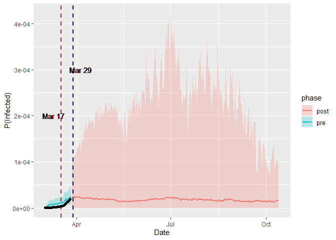

# Current Scenario in INDIA

Taking cue from global powerhouses failing catastrophically to contain the onslaught on life that's been lunched by Covid-19, Prime Minister of India Shri Narendra Modi issued instructions for a nationwide *Lockdown* starting from 25 March'20 to 14 April'20, wth possible plans for further extension. The decision have been welcomed and lauded by various researchers and scientists alike, esopecially after countries like USA and Italy acted too late to a possibly aggravated situation. But why this praise? In this post, we'll find out how lockdown and other forms of quarantining helps contain the infection.

But before that, a gentle reminder of what we are up against: till date, Covid-19 virus has affected $722$ people in India, and $486702$ people worldwide and has claimed $16$ lives in India till now. We have discussed about the origin of the virus and possible measures to contain infection in our last [post](https://soham01.netlify.com/post/covid19-project/).

# Introduction

This is a post to show how we can incorporate quarantining effects in statistical modelling of epidemiology. In past few days of Shelter-in-place lockdown situation in Kolkata (and throughout the whole India from today onwards), me and one of my ingenious friend [Subhrajyoty Roy](https://subroy13.github.io/) (we were attending the same college before lockdown to purse Masters degree in Statistics), was reading about different epidemiological models available in the literature and using it to generate projections for the number of infected people in India, and this is a result of that reading and further independent developements.


# Loading the Packages and the Dataset

We are using the same dataset source as before, except that we have updated it to include some of the current observations. Similar to before, we shall be using `dplyr` for data manipulation and summarization, `lubridate` for handling dates and times, and `ggplot2` for plotting.

However, due to some Monte Carlo simulation later, we shall be needing `rjags` and we shall use `gtools` for specification of some useful probability distributions.


```r
library(readr)
library(dplyr)
library(lubridate)
library(ggplot2)
library(rjags)
library(gtools)
```

Now, finally we load the updated dataset, which I have already downloaded from [JHU CSSE](https://github.com/CSSEGISandData/COVID-19), and manipulated to get the required form of data using the code discussed in my previous post [here](https://subroy13.github.io/post/post6/). We shall take a look at the last few columns to see how much we have updated.


```r
dat <- read_csv('./datasets/covid-19-data.csv')
knitr::kable(tail(dat, 3))
```


| State    |  Country  |      Lat  |     Long | Date    |  Confirmed |  Deaths |  Recovered |
|--------- | -------- | -------- | --------- | ----------- | ---------- | ------- | ----------|
| Zhejiang |  China  |    29.1832 |  120.0934 | 2020-03-24 |     1240   |     1   |     1221  |
| Zhejiang |  China  |    29.1832 |  120.0934 | 2020-03-25 |     1241   |     1   |     1221  |
| Zhejiang |  China  |    29.1832 |  120.0934 | 2020-03-26 |     1243   |     1   |     1222  |

# Description of eSIR Model

The eSIR (Extended SIR) model is really similar to the SIR model, except for the fact that it includes  a function that parametrizes the quarantining effects. As with SIR modelling, it has 3 different compartments, of states in which a person can be. This model has been developed very recently by [Wang et al.](https://www.medrxiv.org/content/10.1101/2020.02.29.20029421v1.full.pdf) The states are as follows:


As described in previous [post](https://subroy13.github.io/post/post6/), **Susceptibles** are the general population, who is susceptible to get the disease from an infectious person. **Infected** state reperesents the persons who have the symptoms of the infection and is able to spread it. And finally, **Recovered / Removed** is the state when a person is recovered from the disease and gain immunity to it, or is dead. Let, $Y_t^S, Y_t^I, Y_t^R$ denotes the proportion of people in these states respectively at the time $t$. Note that $Y_t^S + Y_t^I + Y_t^R = 1$.  $\pi(t)$ denotes the proportion of people transiting from **Susceptible** to **Infected** state at time $t$, with the *proportion* being commensurate to the proportion of people transiting from **Susceptible** to **Infected** state at time $t$ in the original SIR modelling. Thus We can vary $\pi(t)$ from time to time to perfectly capture the effect of quarantining. In other words, the rate at which a susceptible person becomes infected is not a time varying proportion, namely $\beta \pi(t)$, where $\beta$ is the usual rate of transmission of the disease, while $\pi(t)$ is the quarantining effect which might restrict movements of general public in order to make the effective transmission rate lower than the usual quantity $\beta$.

Let $\theta_t=(\theta_t^S, \theta_t^I, \theta_t^R)^T$ be the vector of underlying prevalence of the population in these three states. Since $Y_t^S, Y_t^I, Y_t^R$ are proportions, we model them via Beta distribution: 

$$\begin{align}
Y\_t^I \mid \theta_t, \tau \sim \text{Beta}(\lambda^I\theta\_t^I,\lambda^I(1-\theta\_t^I))\\\\\\
& \\\\\\
Y\_t^R \mid \theta_t, \tau \sim \text{Beta}(\lambda^R\theta\_t^R,\lambda^R(1-\theta\_t^R))\\\\\\
\end{align}$$

where $\tau=(\beta, \gamma, \theta_0^T, \kappa, \lambda^I, \lambda^R)^T$, $\beta$, $\gamma$ are as in SIR model; $\kappa$, $\lambda^I, \lambda^R$ are parameters governing the latent process we'll define soon.

Since $\theta_t$ is a probability, we specify a Dirichlet model for it:

$$\theta\_t \mid \theta\_{t-1}, \tau \sim \text{Dirichlet} (k f(\theta\_{t-1}, \beta, \gamma))$$

These together is called a Beta-Dirichlet State Space Model. 

Here $f(\cdot)$ is the solution of the system of ODEs:

$$\begin{align}
\dfrac{d\theta\_t^S}{dt} & = -\pi(t)\beta \theta\_t^S \theta\_t^I\\\\\\
& \\\\\\
\dfrac{d\theta\_t^I}{dt} & = \pi(t)\beta \theta\_t^S \theta\_t^I - \gamma \theta\_t^I\\\\\\
& \\\\\\
\dfrac{d\theta\_t^R}{dt} & = \gamma \theta\_t^I\\\\\\
\end{align}$$

and this is exactly where the SIR modelling takes place. We solve this system of ODEs via *Runge-Kutta*(RK4) approximation.

To implement the Markov Chain Monte Carlo method, we need to specify prior for the hyperparameters $\tau=(\beta, \gamma, \theta\_0^T, \kappa, \lambda^I, \lambda^R)^{\top}$. We do that as follows:

We initialize $\theta_0$ via a distribution that uses the observed data:

$$\begin{align}
\theta\_0^I \sim \text{Beta}(1, \dfrac{1}{Y\_1^I})\\\\\\
& \\\\\\
\theta\_0^R \sim \text{Beta}(1, \dfrac{1}{Y\_1^R})\\\\\\
& \\\\\\
\theta\_0^S= 1-\theta\_0^I-\theta\_0^R\\\\\\
\end{align}$$

We specify the other hyperparameters according to the [SARS data](https://arxiv.org/pdf/1007.0908.pdf) in Hong-Kong. 

$$\begin{align}
R\_0= \dfrac{\beta}{\gamma} \sim \text{Log}\mathbb{N}(1.099,0.096) \implies \mathbb{E}(R\_0)=3.15, \mathbb{V}(R\_0)=1 \\\\\\
& \\\\\\
\gamma \sim \text{Log}\mathbb{N}(-2.955,0.910) \implies \mathbb{E}(\gamma)=0.0117, \mathbb{V}(\gamma)=0.01 \\\\\\
& \\\\\\
k \sim \text{Gamma}(2, 0.0001)\\\\\\
&  \\\\\\
\lambda^I \sim \text{Gamma}(2, 0.0001)\\\\\\
& \\\\\\
\lambda^R \sim \text{Gamma}(2, 0.0001)\\\\\\
\end{align}$$

Now suppose , data upto time point $t_0$ are observed: $(Y\_1, \cdots Y\_{t\_0})$. We want to predict upto time point $T$. To this end, we generate $M$ MCMC samples, such that for $m \in \{1,\cdots, M\}$, $(Y\_{t\_0+1}^{(m)}, \cdots, Y\_T)$ is a draw from $Y\_t \mid \theta\_t, \tau$. The algorihm is described below:


for $m$ in $1, \cdots, M$

$\qquad$  for $t$ in $t_0+1,\cdots, T$,

$\qquad \qquad$  Draw $\theta_t^{(m)}$ from $[\theta\_t \mid \theta\_{t-1}^{(m)}, \tau^{(m)}]$.

$\qquad \qquad$  Draw $Y_t^{(m)}$ from $[Y\_t \mid \theta\_{t}^{(m)}, \tau^{(m)} ]$
         

Finally for each time point $t$, $t= t\_0+1,\cdots, T$ estimate $Y\_t$ by $\hat{Y}\_t=\dfrac{1}{M}\displaystyle \sum\_{m=1}^M Y\_t^{(m)}$.        


# Estimation of eSIR Model

## Initialization

Note that, we wish to have a lognormal distribution $R_0 \sim LogN(\mu, \sigma^2)$, such that, $E(R_0), Var(R_0)$ is at a specified value. The specific reason is that, $R_0 = \beta_0 / \gamma_0$, which is a positive quantity, hence is better modelled by a gamma or lognormal distribution than a normal distribution, which has support as the whole of real line. Therefore, given $E(R_0) = a$, and $Var(R_0) = b$, we wish to figure out $\mu, \sigma$, the parmeters of the lognormal distribution. This can be obtained through the following simple formula and is implemented in the following function.

$$\sigma^2 = \log\left( \dfrac{Var(R_0)}{E(R_0)^2} +1 \right) \qquad \qquad \mu = \log(E(R_0)) - \dfrac{\sigma^2}{2}$$


```r
lognorm.param<-function(mu0,var0){
  var <- log(var0/mu0^2+1)
  mu <- log(mu0)-var/2
  return(round(c(mu,var),3))
}
```


Now, we specify some control parameters, which specifies the initial $E(R_0), Var(R_0)$ and some other parameters, as well as the parameters for the markov chain (like the length of the chain, the number of parallel chains to construct in order to speed up the process, number of samples to define burn in period etc.) You may want to skip these technical details for now.


```r
init.params <- list(R0 = 3.15, R0_sd = 1, gamma0 = 0.0117, gamma0_sd = 0.1)
control.params <- list(nchain=4, nadapt=1e4, ndraw=5e2, thin=10, nburnin=2e2)
control.params$mclen <- round(control.params$ndraw / control.params$thin) * control.params$nchain    #number of MCMC draws in total
```

## Performing MCMC

Now, we shall be creating a function called `do.MCMC` which takes the observed proportion of Infected (I), Removed ( R ), then the value of the function $\pi(t)$ till the observed time period (and the control parameters). Then, it shall perform the MCMC step by generating the posterior sampels, and it shall output that posterior samples, which we shall later use to generate predictions, as well as get estimates.

### Defining the JAGS Code

The very first thing to implement MCMC or any Bayesian Computation in `rjags` is the specification of a JAGS code. JAGS is the acronym for [**Just Another Gibbs Sampler**](http://mcmc-jags.sourceforge.net/), which is a program for simulation from Bayesian hierarchical models using Markov chain Monte Carlo (MCMC), developed by Martyn Plummer.

JAGS code is mainly created based on two simple operations.

1. An assignment operator "<-" is used to denote a deterministic relation.

2. A tilde operator "~" is used to denote a stochastic relation. In this case, we have a probability distribution on right hand side, according to which the left hand side variable is being generated. 


Based on the above operations, the following JAGS code creates the Bayesian model described above.


```r
model.string <- paste0("
             model{
                   for(t in 2:(T_obs+1)){
                   Km[t-1,1] <- -beta*pi[t-1]*theta[t-1,1]*theta[t-1,2]
                   Km[t-1,9] <- gamma*theta[t-1,2]
                   Km[t-1,5] <- -Km[t-1,1]-Km[t-1,9]
                   Km[t-1,2] <- -beta*pi[t-1]*(theta[t-1,1]+0.5*Km[t-1,1])*(theta[t-1,2]+0.5*Km[t-1,5])
                   Km[t-1,10] <- gamma*(theta[t-1,2]+0.5*Km[t-1,5])
                   Km[t-1,6] <- -Km[t-1,2]-Km[t-1,10]
                   Km[t-1,3] <- -beta*pi[t-1]*(theta[t-1,1]+0.5*Km[t-1,2])*(theta[t-1,2]+0.5*Km[t-1,6])
                   Km[t-1,11] <- gamma*(theta[t-1,2]+0.5*Km[t-1,6])
                   Km[t-1,7] <- -Km[t-1,3]-Km[t-1,11]
                   Km[t-1,4] <- -beta*pi[t-1]*(theta[t-1,1]+Km[t-1,3])*(theta[t-1,2]+Km[t-1,7])
                   Km[t-1,12] <- gamma*(theta[t-1,2]+Km[t-1,7])
                   Km[t-1,8] <- -Km[t-1,4]-Km[t-1,12]
                   alpha[t-1,1] <- theta[t-1,1]+(Km[t-1,1]+2*Km[t-1,2]+2*Km[t-1,3]+Km[t-1,4])/6
                   alpha[t-1,2] <- theta[t-1,2]+(Km[t-1,5]+2*Km[t-1,6]+2*Km[t-1,7]+Km[t-1,8])/6
                   alpha[t-1,3] <- theta[t-1,3]+(Km[t-1,9]+2*Km[t-1,10]+2*Km[t-1,11]+Km[t-1,12])/6
                   theta[t,1:3] ~ ddirch(k*alpha[t-1,1:3])
                   I[t-1] ~ dbeta(lambdaI*theta[t,2],lambdaI*(1-theta[t,2]))
                   R[t-1] ~ dbeta(lambdaR*theta[t,3],lambdaR*(1-theta[t,3]))
                  }
                  theta[1,1] <-  1- theta[1,2]- theta[1,3]
                  theta[1,2] ~ dbeta(",1,",",1/I[1],")
                  theta[1,3] ~ dbeta(",1,",",1/R[1],")
                  gamma ~  dlnorm(",lognorm_gamma_param[1],",",1/lognorm_gamma_param[2],")
                  R0 ~ dlnorm(",lognorm_R0_param[1],",",1/lognorm_R0_param[2],")
                  beta <- R0*gamma
                  k ~  dgamma(2,0.0001)
                  lambdaI ~ dgamma(2,0.0001)
                  lambdaR ~ dgamma(2,0.0001)
               }
            ")
```


Here, `init.params` are to be passed accordingly in `lognorm.param` function to obtain the `lognorm_gamma_param` and `lognorm_R0_param` variables.

### Performing MCMC

Now, once we have the `model.string` containing the JAGS code, we need to open a connection object to that string. Because, `rjags` expect the JAGS code to be written in a file, a connection object can gimick the behavior of a file, just based on that string. Once we have the JAGS code ready, passing the data nodes in the JAGS model helps us in creating the posterior model.


```r
model.spec <- textConnection(model.string)
posterior <- jags.model(model.spec, data=list('I'=I,'R'=R,'T_obs'=T_obs,'pi'=pi), 
                    n.chains =control.params$nchain, n.adapt = control.params$nadapt)
```


Now, we first update the posterior for the burn-in period. In this time, the posterior generates samples are not close to the original sample, and hence we need to discard them. Typically, we set burn-in to be about $2000$ iterations. After that, we pass


```r
update(posterior, control.params$nburnin) # update the posterior for burn in times, for this time, do not monitor anything
jags_sample <- jags.samples(posterior, c('theta','gamma','R0','beta','I','lambdaI','lambdaR','k'),
                        n.iter = control.params$ndraw * control.params$nchain,
                        thin = control.params$thin)
```


So, we combine these into a function called `do.MCMC` which we shall use later.


## Forecasting using eSIR model

Now, since we have the MCMC samples obtained as the output of `do.MCMC` function, we can extend the chain using the exact simulation of the process described by the model above, and then, we can obtain the estimates of the proportion of infected and recovered people, as well as the confidence interval for that proportion.

Again, we shall create `forecast.SIR` function which takes in the output of `do.MCMC`, and then run the simulation chains starting from the MCMC samples. Finally, it computes the estimates and confidence intervals for the estimates of proportion of infected and removed from the samples from all the chains.


### Extract components of MCMC samples

Here, we extract the components of MCMC samples from the output of `do.MCMC` function.


```r
# extract components from mcmc samples 
theta_pre <- array(as.mcmc.list(mcmc_sample$theta)[[1]], dim = c(control.params$mclen, T_obs+1, 3))
R0_pre <- as.mcmc.list(mcmc_sample$R0)[[1]]
gamma_pre <- as.mcmc.list(mcmc_sample$gamma)[[1]]
beta_pre <- as.mcmc.list(mcmc_sample$beta)[[1]]
lambdaI_pre <- as.mcmc.list(mcmc_sample$lambdaI)[[1]]
lambdaR_pre <- as.mcmc.list(mcmc_sample$lambdaR)[[1]]
k_pre <- as.mcmc.list(mcmc_sample$k)[[1]]
```

We also initialize blank arrays to store the future forecasts. Here, `T_new` is the number of time points for which new forecasting is to be done.


```r
theta_post <- array(0, dim=c(control.params$mclen, T_new, 3))
I_post <- matrix(NA, nrow=control.params$mclen, ncol=T_new)
R_post <- matrix(NA, nrow=control.params$mclen, ncol=T_new)
```


### Peform Forecasting

The following piece of code basically performs the forecasting starting from the last obtained posterior samples as obtained by MCMC. Now, let us go through the code step by step.


```r
for(l in 1:control.params$mclen){
    
    thetalt1 <- theta_pre[l, T_obs+1, 1]
    thetalt2 <- theta_pre[l, T_obs+1, 2]
    thetalt3 <- theta_pre[l, T_obs+1, 3]
    betal <- beta_pre[l]
    gammal <- gamma_pre[l]
    kt <- k_pre[l]
    lambdaIl <- lambdaI_pre[l]
    lambdaRl <- lambdaR_pre[l]
    if (betal<0 | gammal<0 | thetalt1<0 | thetalt2<0 |thetalt3<0) { 
      next 
    }
    
    
    for(t in 1:T_new ){
      # perform runge kutta
      Km <- numeric(12)
      alpha_post <- numeric(3)
      
      Km[1] <- -betal*pi_new[t]*thetalt1*thetalt2
      Km[9] <- gammal*thetalt2
      Km[5] <- -Km[1]-Km[9]
      
      Km[2] <- -betal*pi_new[t]*(thetalt1+0.5*Km[1])*(thetalt2+0.5*Km[5])
      Km[10] <- gammal*(thetalt2+0.5*Km[5])
      Km[6] <- -Km[2]-Km[10]
      
      Km[3] <- -betal*pi_new[t]*(thetalt1+0.5*Km[2])*(thetalt2+0.5*Km[6])
      Km[11] <- gammal*(thetalt2+0.5*Km[6])
      Km[7] <- -Km[3]-Km[11]
      
      Km[4] <- -betal*pi_new[t]*(thetalt1+Km[3])*(thetalt2+Km[7])
      Km[12] <- gammal*(thetalt2+Km[7])
      Km[8] <- -Km[4]-Km[12]
      
      alpha_post[1] <- thetalt1+(Km[1]+2*Km[2]+2*Km[3]+Km[4])/6
      alpha_post[2] <- thetalt2+(Km[5]+2*Km[6]+2*Km[7]+Km[8])/6
      alpha_post[3] <- thetalt3+(Km[9]+2*Km[10]+2*Km[11]+Km[12])/6
      
      thetalt_tmp <- rdirichlet(1, kt* abs(alpha_post))
      thetalt1 <- theta_post[l,t,1] <- thetalt_tmp[1]
      thetalt2 <- theta_post[l,t,2] <- thetalt_tmp[2]
      thetalt3 <- theta_post[l,t,3] <- thetalt_tmp[3]
      
      I_post[l,t] <- rbeta(1,lambdaIl*thetalt2,lambdaIl*(1-thetalt2))
      R_post[l,t] <- rbeta(1,lambdaRl*thetalt3,lambdaRl*(1-thetalt3))
      
    }
    
  }
```


1. The outer loop runs for each of the MCMC chains generated by `mcmc_output`.

2. If any of $\beta, \gamma, \theta^S,\theta^I, \theta^R$ turns out to be less than $0$, the chain is stopped and is not proceeded further.

3. In the inner loop, for each new timepoint, we perform the [Runge Kutta methods](https://en.wikipedia.org/wiki/Runge%E2%80%93Kutta_methods) of numerically solving the differential equations, 

4. At the end of the loop, we have all the estimates for proportion of Infected and Removed, as well as the three latent proportion parameters $\theta$ which accords with the underlying mathematical model of SIR.

5. Here, `pi_new[t] = pi[T_obs + t]`.


### Derivation of 3 important dates

Associated with the estimation of eSIR model, there are three important dates, which we should output from our algorithm. 

1. The date when $\dfrac{d^2 \theta^I_t}{dt^2} = 0$. This date is the time, when the rate of change in the proportion of infected people starts to be decreasing, so we are in a hopeful scenario that the number of new infected cases is going to be decreasing over time.

2. The date when $\dfrac{d \theta^I_t}{dt} = 0$, i.e. the date from when the number of new recovered cases starts to exceed the number of new infected cases. From this time onwards, the epidemic nature of the disease vanishes.

3. The date when $\theta^I_t = 0$. However, it is impossible to have this proportion equal to $0$, in finite times. Therefore, we shall be looking for a date, when $\theta^I_t < \epsilon$, where $\epsilon$ is a very small quantity, which can be treated readily at any time.

To simplify the calculation of derivative, we track the quantity $(\beta \pi(t) \theta^S\_t\theta^I\_t - \gamma \theta^I\_t)$ over time, which is equal to the derivative due to SIR modelling.


The following picture taken from the [paper](https://www.medrxiv.org/content/10.1101/2020.02.29.20029421v1.full.pdf) by Wang et al. shows the concept clearly.


```r
theta_diff_pre <- theta_pre[, 1:T_obs, 2] * sweep(beta_pre %*% t(pi[1:T_obs]) * theta_pre[, 1:T_obs, 1], MARGIN = 1, STATS = gamma_pre)
theta_diff_post <- theta_post[, , 2] * sweep(beta_pre %*% t(pi[(T_obs+1):(T_obs+T_new)]) * theta_post[, , 1], MARGIN = 1, STATS = gamma_pre)
theta_diff <- cbind(theta_diff_pre, theta_diff_post)
```

Now, we find the maximum of each row of `theta_diff` and locate the timepoints, where `theta_diff` is changing its signs. They should give up the required first and second important dates.


```r
first_dates <- apply(theta_diff, 1, which.max)
second_dates <- apply(theta_diff, 1, function(x) { length(x) + 1 - which(cumprod(rev(x <= 0)) == 0)[1] } )    # the first time it becomes negative and stays negative throughout
```

Now, that we have the dates for each chain, let us take the mean, median, and quantiles, which would give us estimates and confidence intervals for such dates.


```r
conf.quant <- c(conf.level/2, 0.5, 1-conf.level/2)    # conf.level is the confidence coefficients for the confidence interval
first_date_summary <- c( mean(first_dates, na.rm = T), quantile(first_dates, probs = conf.quant, na.rm = T) )
second_date_summary <- c( mean(second_dates, na.rm = T), quantile(second_dates, probs = conf.quant, na.rm = T) )
```


### Summarising the forecast outputs

Once we have perform forecasting for each and every chain of the MCMC samples, we can aggregated them to obtain the mean, median, and quantiles, which would give us estimates for the proportion of people in state infected and removed, as well as the confidence interval for those estimates.


```r
# till the observed time points
thetaI_band <- t(apply(theta_pre[,-1,2] , 2, quantile, probs=conf.quant, na.rm=T))   
thetaR_band<- t(apply(theta_pre[,-1,3] , 2, quantile, probs=conf.quant, na.rm=T))
thetaI_mean <- colMeans(theta_pre[, -1, 2], na.rm = T)
thetaR_mean <- colMeans(theta_pre[, -1, 3], na.rm = T)

# for the new time points
YI_band <- t(apply(I_post , 2, quantile, probs=conf.quant, na.rm=T))   
YR_band<- t(apply(R_post , 2, quantile, probs=conf.quant, na.rm=T))
YI_mean <- colMeans(I_post, na.rm = T)
YR_mean <- colMeans(R_post, na.rm = T)

# combine into a data frame
infected.dat <- data.frame( rbind( cbind(thetaI_mean, thetaI_band, rep("pre", T_obs) ), cbind(YI_mean, YI_band, rep("post", T_new) ) ) )
removed.dat <- data.frame( rbind( cbind(thetaR_mean, thetaR_band, rep("pre", T_obs) ), cbind(YR_mean, YR_band, rep("post", T_new) ) ) )

colnames(infected.dat) <- c("mean", "lower", "median", "upper")
colnames(removed.dat) <- c("mean", "lower", "median", "upper")
```

Then, we can return a list comprising of these two datasets, as well as the summary corresponding to the first and second date obtained earlier. This whole piece of code, is compressed into a function called `forecast.SIR`, which we shall call later.


# Checking Performance of eSIR

Now, we shall be using the data for `Italy`, in order to figure out how our `eSIR` model performs for this data.

## Performance for Italy

According to [Worldometers](https://www.worldometers.info/world-population/italy-population/) sources, the projected population for Italy is about 6 crores. Based on that, we compute the observed proportion of the infected and removed (including deaths and recovered), and fit the eSIR model. The following code calls the `do.MCMC` function and performs the MCMC fitting. Here, we use 4 weeks of data, of the available 5 weeks of data, and we shall try to forecast for the last week, to see how the model performed.

Also, the $\pi(t)$ function choosen for Italy is as follows;

$$\pi(t) = \begin{cases}
1 & \text{ if } t < \text{4th March, 2020}\\\\\\
0.25 & \text{ if } t > \text{9th March, 2020}\\\\\\
0.5 & \text{ otherwise }\\\\\\
\end{cases}$$


```r
subdat <- dat %>% mutate(Removed = Deaths + Recovered) %>% filter(Country == "Italy" & Removed > 0)

N <- 60550075
R <- subdat$Removed / N
I <- subdat$Confirmed/N - R
pi0 <- ifelse(subdat$Date < as.Date('2020-03-04'), 1, 
              ifelse(subdat$Date > as.Date('2020-03-09'), 0.25, 0.5))

init.params <- list(R0 = 3.15, R0_sd = 1, gamma0 = 0.0117, gamma0_sd = 0.1)
control.params <- list(nchain=4, nadapt=1e4, ndraw=5e2, thin=10, nburnin=2e2)
control.params$mclen <- round(control.params$ndraw / control.params$thin) * control.params$nchain 

mcmc_samples <- do.MCMC(I[1:28], R[1:28], pi0[1:28], init.params, control.params)
```

You should see something like this, which tells you that the JAGS code for MCMC is running properly.

```
Compiling model graph
   Resolving undeclared variables
   Allocating nodes
Graph information:
   Observed stochastic nodes: 56
   Unobserved stochastic nodes: 35
   Total graph size: 1591

Initializing model
```

As we see from the following plot, the predictions for the last week is underestimating the true proportions. However, the observed proportions lie within the bound of $95\%$ confidence band.


```r
preds <- forecast.SIR(7, 28, mcmc_samples, pi = pi0, control.params = control.params, start.date = "2020-02-21")
ggplot(preds$infected, aes(x = date)) + 
    geom_ribbon(aes(ymin = lower, ymax = upper, fill = phase), alpha = 0.25) +
    geom_line(aes(y = mean, color = phase), size = 1) +
    labs(x = "Date", y = "P(Infected)") +
    geom_point(data = subdat, aes(x = Date, y = (Confirmed - Removed)/N), color = "black")
```


However, if we assume that, the Italy government maintains the current lockdown indefinitely, then $\pi(t) = 0.25$ will continue to remain. In such case, the important dates (as mentioned above) for change in the rate of newly infected can be obtained, as shown in the following plot.


```r
pi0 <- c(pi0, rep(0.25, 200))
preds <- forecast.SIR(7+200, 28, mcmc_samples, pi = pi0, control.params = control.params, start.date = "2020-02-21")
ggplot(preds$infected, aes(x = date)) + 
    geom_ribbon(aes(ymin = lower, ymax = upper, fill = phase), alpha = 0.25) +
    geom_line(aes(y = mean, color = phase), size = 1) +
    geom_vline(xintercept = preds$first.date[1], color = "brown") + 
    geom_vline(xintercept = preds$second.date[1], color = "blue4") +
    labs(x = "Date", y = "P(Infected)") +
    geom_point(data = subdat, aes(x = Date, y = (Confirmed - Removed)/N), color = "black") +
    geom_text(x = preds$first.date[1] - 1, y = 0, label = format(preds$first.date[1], "%b %d"), size = 4 ) +
    geom_text(x = preds$second.date[1] - 1, y = 0, label = format(preds$second.date[1], "%b %d"), size = 4 )
```


Therefore, in Italy, at about June 22, we should see decreasing increments of newly infected persons, and from August 1 onwards, the proportion of infected people should decline.


## Estimation for India

However, our main concern is to find out the situation of India based on this eSIR modelling. Here, we shall use the $\pi(t)$ function as follows, as per various decision taken by the Government, like restriction on international flights, Janta Curfew and full scale lockdowns etc.

$$\pi(t) = \begin{cases}
1 & \text{ if } t < \text{15th March, 2020}\\\\\\
0.95 & \text{ if } \text{15th March, 2020} < t < \text{19th March, 2020}\\\\\\
0.9 & \text{ if } \text{19th March, 2020} < t < \text{22th March, 2020}\\\\\\
0.5 & \text{ if } \text{22th March, 2020} < t < \text{25th March, 2020}\\\\\\
0.1 & \text{ if } t > \text{25th March, 2020}\\\\\\
\end{cases}$$


Also, note that in India, many places are rural in nature, while most of the urban population and neighbourhood areas are more susceptible to get the disease than others, due to availablity of metro cities and international airports. So, rather than using the whole population size i.e. $131$ crores as $N$, we shall use about $350$ lakhs as the adjusted population size.


```r
subdat <- dat %>% mutate(Removed = Deaths + Recovered, Infected = Confirmed - Removed) %>%
    filter(Country == "India" & Removed > 0 & Infected > 0)

N <- 350e5   # adjusted population for metro cities and neighbourhood areas

R <- subdat$Removed / N
I <- subdat$Infected/N

pi0 <- ifelse(subdat$Date < as.Date('2020-03-15'), 1, 
              ifelse(subdat$Date < as.Date('2020-03-19'), 0.9, 
                     ifelse(subdat$Date < as.Date('2020-03-22'), 0.8, 
                            ifelse(subdat$Date < as.Date('2020-03-25'), 0.5, 0.1)) ))

init.params <- list(R0 = 12.48, R0_sd = 1, gamma0 = 0.117, gamma0_sd = 1)
control.params <- list(nchain=4, nadapt=1e4, ndraw=5e2, thin=5, nburnin=2e2)
control.params$mclen <- round(control.params$ndraw / control.params$thin) * control.params$nchain 

mcmc_samples <- do.MCMC(I, R, pi0, init.params, control.params)
```

And finally, we perform the prediction till the end of the lockdown, i.e. till $14$-th April, to see the effect of quaranting.

```r
pi1 <- c(pi0, rep(0.1, 19))   # from 27th March, it is 19 days of lockdown left 
preds <- forecast.SIR(19, 25, mcmc_samples, pi = pi1, control.params = control.params, start.date = "2020-03-02")
ggplot(preds$infected, aes(x = date)) + 
    geom_ribbon(aes(ymin = lower, ymax = upper, fill = phase), alpha = 0.25) +
    geom_line(aes(y = mean, color = phase), size = 1) +
    labs(x = "Date", y = "P(Infected)") +
    geom_point(data = subdat, aes(x = Date, y = Infected/N), color = "black")
```


Although it seems that the mean proportion is overestimated during the ovserved period, however the effect of quanting seems to work to a moderate extent, as the estimated proportion stays more or less at the same level. The exact count of the infected people at the end of lockdown, provided that it is maintained properly, should be about $1317$ many infected persons, and about $2114$ confirmed cases of COVID-19.

Similar to Italy, if we extend its forecast for some more days, and keep the same level of quaranting, the model predictions are given in the following plot.


```r
pi2 <- c(pi0, rep(0.1, 200)) 
preds <- forecast.SIR(200, 25, mcmc_samples, pi = pi2, control.params = control.params, start.date = "2020-03-02")
ggplot(preds$infected, aes(x = date)) + 
    geom_ribbon(aes(ymin = lower, ymax = upper, fill = phase), alpha = 0.25) +
    geom_line(aes(y = mean, color = phase), size = 1) +
    geom_vline(xintercept = preds$first.date[1], color = "brown", size = 1, linetype = "dashed") + 
    geom_vline(xintercept = preds$second.date[1], color = "blue4", size = 1, linetype = "dashed") +
    labs(x = "Date", y = "P(Infected)") +
    geom_point(data = subdat, aes(x = Date, y = (Confirmed - Removed)/N), color = "black") +
    geom_text(x = preds$first.date[1] - 7, y = 2e-4, label = format(preds$first.date[1], "%b %d"), size = 4 ) +
    geom_text(x = preds$second.date[1] + 7, y = 3e-4, label = format(preds$second.date[1], "%b %d"), size = 4 )
```




Therefore, as it seems, if we keep the lockdown (as it is now), based on the data, it might take till October to have the proportion of infected people becoming insignificant, provided we keep the same level of quanranting effect. However, from March 17, we should see a decrease in the rate of increment in the number of infected, and from March 29 onwards, we should be at a position from where the number of newly infected persons per day starts to decrease.

Since, it is very economically and physically dissatisfying to be in a lockdown (or state of home quarantine till October, where Durga Puja festival is going to occur), we might want to go outside. In that case, assuming $\pi(t)$ increases to $0.5$, which is indeed less than 1, due to our increasing awareness of the scenario, then, the predicted situation would look like this.


```r
pi3 <- c(pi0, rep(0.1, 19), rep(0.5, 2 * 365)) 
preds <- forecast.SIR(2 * 365 + 19, 25, mcmc_samples, pi = pi3, control.params = control.params, start.date = "2020-03-02")
preds$infected$upper_new <- pmin(preds$infected$upper, 0.05)   # just for visual purpose
ggplot(preds$infected, aes(x = date)) + 
    geom_ribbon(aes(ymin = lower, ymax = upper_new, fill = phase), alpha = 0.25) +
    geom_line(aes(y = mean, color = phase), size = 1) +
    geom_vline(xintercept = preds$first.date[1], color = "brown", size = 1, linetype = "dashed") + 
    geom_vline(xintercept = preds$second.date[1], color = "blue4", size = 1, linetype = "dashed") +
    labs(x = "Date", y = "P(Infected)") +
    geom_point(data = subdat, aes(x = Date, y = (Confirmed - Removed)/N), color = "black") +
    geom_text(x = preds$first.date[1] - 7, y = 2e-4, label = format(preds$first.date[1], "%b %d"), size = 4 ) +
    geom_text(x = preds$second.date[1] + 7, y = 3e-4, label = format(preds$second.date[1], "%b %d"), size = 4 )
```


This scenario would be very severe for us, since it would affect about $4\%$ of the urban population, on about June 13, and then it would start to decrease gradually. However, it would take almost 2 years, to make this epidemic insignificant, provided there will be no generally accepted antiviral medicine for COVID-19 till then.

Hence, we must avoid such situation at all costs, and to counter it, we must stay home, at a shelter in place home quaranting atmosphere.

# Conclusion

This **eSIR model is not perfect.** No statistical model is. But the main idea and examples that we are seeing currently all over the world, should give us a hint about what is to come.

There are several backdrops in **eSIR** model.

1. It does not talk about underreporting. When you are in a place like India, underreporting is a major issue, as there might be some people who are affected by coronavirus, but lightly takes their symptoms as seasonal cold.

2. In the basis of SIR model, we assume the existence of only 3 states. To incorporate the effect of quaranting, we only considering the people in Infected state. However, there might be people who are infected, and can spread the disease, yet they do not have the symptoms, and hence does not fall under the effect of quaranting.

We shall try to deal with these shortcomings in our next post, where we shall consider building more out of this particular model.


**WHO Guidelines to STAY SAFE:**

- The best way to prevent and slow down transmission is be well informed about the COVID-19 virus, the disease it causes and how it spreads.

- Wash your hands frequently with an alcohol based rub or soap.

- Maintain social distancing.

- Avoid touching eyes, nose and mouth.

- Practice respiratory hygiene.

- If you have fever, cough and difficulty breathing, seek medical care early.

- Stay informed and follow advice given by your healthcare provider.

- Protect yourselves and protect others.


**Signing Off**

$\qquad ---$ Subhrajyoty Roy \& Soham Bonnerjee


> Stay home, Stay safe, Keep safe your friends, families and neighbours.


